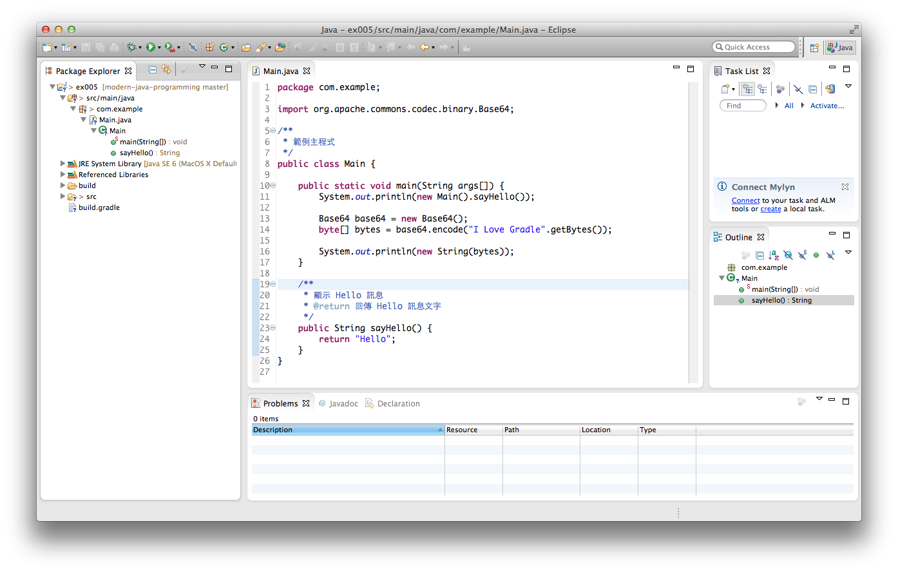

使用 Gradle 自動化建置 Java 專案（五）
=================================

Gradle 是用途廣泛的建置工具，但最重要的一點，就是非常適合處理 Java 專案，它讓 Java 專案自動化建置（Build Automation）變得更容易上手。

使用 Gradle 管理的專案，很適合搭配 Eclipse IDE 開發工具作程式碼編輯，本篇將介紹 Eclipse Plugin for Gradle 的使用方式。


### Eclipse Plugin ###

Java 是規則嚴謹的程式語言，而 Java API 龐大又複雜，如果沒有 IDE 工具的輔助，即使是資深程式設計師，也可能經常疏忽犯錯。即使我們用 Gradle 取代一部分 IDE 的功能（有關建置流程的部份）；但是 IDE 對語法的色彩顯示、錯誤及缺陷自動檢查、自動完成與重構（Refactoring）等功能，我們還是需要依賴 Eclipse 工具協助。

Gradle 啟用 Eclipse Plugin 只要加入一行設定：

```
apply plugin: 'eclipse'
```

然後執行 gradle 指令：

```
gradle eclipse
```

Eclipse Plugin 提供兩個指令：

* eclipse - 產生所有 Eclipse 所需的設定檔案
* cleanEclipse - 清除所有自動產生的 Eclipse 設定檔

產生的檔案主要是以下三個：

1. ``.project`` 專案定義檔
2. ``.classpath`` CLASSPATH 路徑定義檔
3. ``.settings/*`` Eclipse 各項功能的設定檔

打開 Eclipse 開發工具。

在 Eclipse 中，我們不需要新增 Java 專案，而是匯入 Gradle 已經幫我們產生的專案，所以要選擇「File / Import」，從「General / Exisiting Projects into Workspace」設定某個專案的路徑，將其匯入到 Eclipse 的工作區（workspace）。



在 Gradle 與 Eclipse 的相互搭配下，Eclipse 只負責扮演程式碼編輯器的工作，有關於建置的流程，例如執行（Run）或測試（Test），就由 Gradle 指令來處理。一般開發者不必學習太多 Eclipse 的進階功能，只要將使用它的重點放在提高程式碼撰寫效率的功能上。

由於 Java 的開發較依賴 IDE，除非是寫 Hello World，不然一般 Java 程式用到的類別分佈在非常多的 Package 路徑，通常不會有人記憶力好到能記住一堆 Package 的完整命名，以及某個類別下有哪些 Method 可用。

但如果只是微幅的程式碼修改，這種以 Gradle 為主的建置方式，就可以不必打開笨重肥大的 IDE 工具，使用一般慣用的文字編輯器如 Vim 或 Sublime Text 就能勝任。

本文使用的範例程式碼，可在以下網址取得：

* http://git.io/TiR2YA

參考資料：

1. [Building and Testing with Gradle, O'Reilly](http://shop.oreilly.com/product/0636920019909.do)
2. [Gradle User Guide](http://www.gradle.org/documentation)
