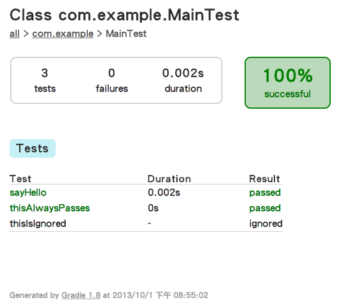

使用 Gradle 自動化建置 Java 專案（六）
=================================

Gradle 是用途廣泛的建置工具，但最重要的一點，就是非常適合處理 Java 專案，它讓 Java 專案自動化建置（Build Automation）變得更容易上手。

你的 Java 專案是否使用 JUnit 做單元測試呢？Gradle 讓測試更容易整合到專案的建置流程，不管是剛寫好或修改一個物件方法，或者準備打包成 JAR 發佈前，多一道測試流程就能幫程式品質做好基本的把關。


### JUnit ###

Gradle 的 Java Plugin 已經內建 Test 的任務定義，開發者只需要指定使用哪一種測試。

```
apply plugin: 'java'
```

常見 Gradle 支援的 Java 程式測試框架包括：

* JUnit
* TestNG
* Spock
* EasyB

我們先介紹 JUnit 的測試整合方式，畢竟它算是元老級的測試框架，Java 開發者不得不認識它呀。

先在 dependencies 設定所依賴的 JUnit 4 函式庫，因為測試案例原始碼編譯就需要 JUnit，所以應該使用 ``testCompile`` 設定：

```
dependencies {
	testCompile 'junit:junit:4.+'
}
```

延續使用已經建立好的 ``Main.java``，開始撰寫第一個測試案例，範例是對 Main 類別進行測試，因此建立新的 MainTest 測試類別。Gradle 預設會將「測試」專用的程式碼，放在 ``src/test`` 資料夾下，因此目前的範例已有以下 Java 程式碼路徑。

* src/main/java/com/example/Main.java
* src/test/java/com/example/MainTest.java

在測試案例中，我們需要測試 Main 的 sayHello() 方法是否正確回傳 "Hello" 字串。

src/test/java/com/example/MainTest.java

```
package com.example;

import static org.junit.Assert.assertEquals;

import org.junit.Test;
import org.junit.runner.RunWith;
import org.junit.runners.JUnit4;

/**
 * Tests for {@link Main}.
 */
@RunWith(JUnit4.class)
public class MainTest {

    @Test
    public void sayHello() {
        assertEquals(new Main().sayHello(), "Hello");
    }
}
```

這個範例使用 JUnit 4 的風格撰寫，可以看到程式碼使用 Annotation（@）的標記，取代過去落落長的舊式寫法。

使用 gradle 指令開始進行測試：

```
gradle test
```

Gradle 會幫我們將 JUnit 的測試結果，自動輸出成容易閱讀的 HTML 網頁格式，儲存在以下路徑。

* build/reports/tests/index.html

使用瀏覽器打開上述位置的網頁檔案，就能看到精美的 JUnit 測試結果報表。



本文使用的範例程式碼，可在以下網址取得：

* http://git.io/dMt5YA

參考資料：

1. [Building and Testing with Gradle, O'Reilly](http://shop.oreilly.com/product/0636920019909.do)
2. [Gradle User Guide](http://www.gradle.org/documentation)
